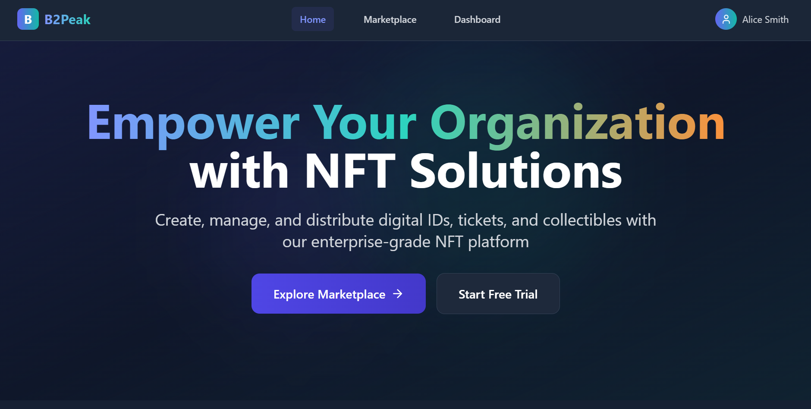
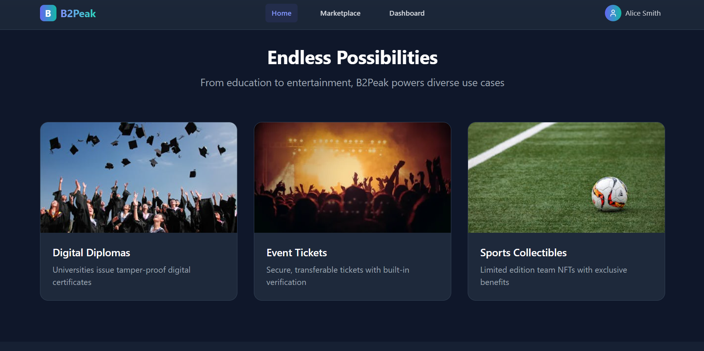
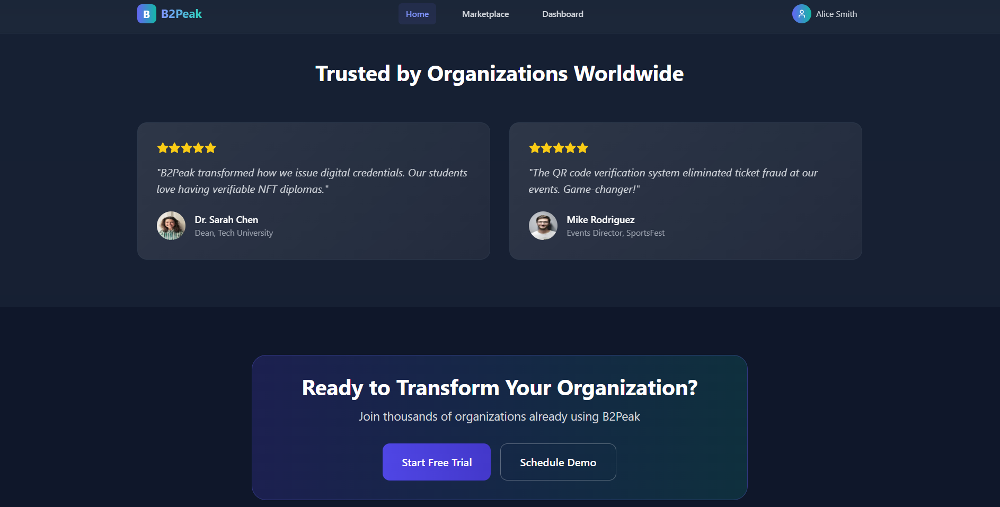
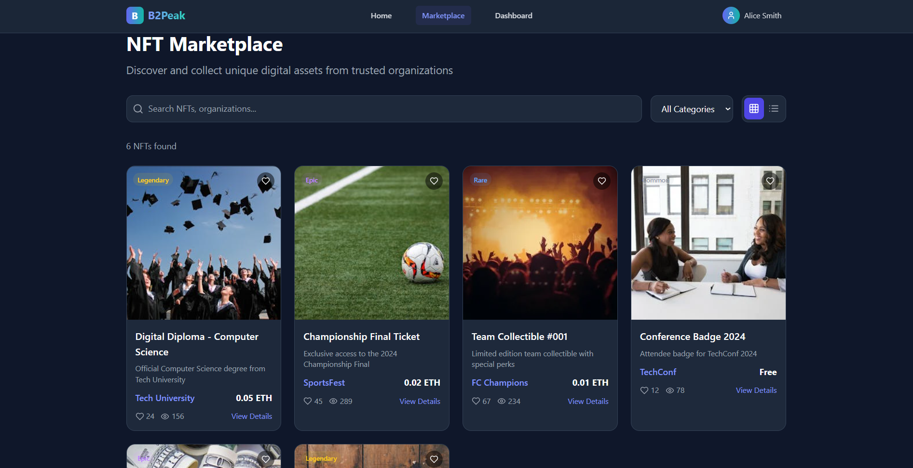
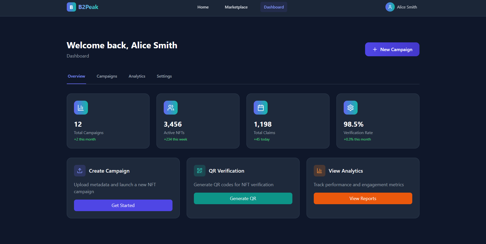

# 🚀 B2Peak - NFT SaaS Platform

<div align="center">
  
</div>

> **Build a SaaS platform where businesses can issue NFTs as digital IDs, tickets, or collectibles to their communities.**

B2Peak es una plataforma B2B SaaS que permite a organizaciones (universidades, equipos deportivos, organizadores de eventos) emitir NFTs como identificaciones digitales, tickets o coleccionables para sus comunidades.

## 🎯 Casos de Uso Principales

- **🏫 Universidades**: Emisión de diplomas NFT o identificaciones de estudiantes
- **⚽ Equipos Deportivos**: NFTs coleccionables de partidos con contenido desbloqueable
- **🎪 Conferencias**: Tickets basados en NFT con acceso QR
- **🏢 Marcas**: NFTs de lealtad como prueba de participación

## 🏗️ Arquitectura

### Frontend
- **React 18** + **TypeScript** + **Vite**
- **TailwindCSS** para estilos
- **React Router** para navegación
- **Lucide React** para iconos
- **QR Code** generator para NFTs

### Backend (Próximamente)
- **NestJS API**
- **PostgreSQL/Supabase** para multi-tenancy
- **Web3 Integration** (EVM, Solana)
- **IPFS/Pinata** para metadata
- **Role-based authentication**

## 🚀 Arquitectura para Producción y Escalabilidad (SaaS)

Para llevar B2Peak a producción y servir a **+1000 usuarios**, la plataforma se diseña con las siguientes características esenciales, garantizando alta disponibilidad, seguridad y rendimiento.

| Característica | Descripción de la Implementación |
| :--- | :--- |
| **☁️ Infraestructura en la Nube** | **Vercel/AWS/Azure**: Despliegue en una plataforma cloud que permita auto-escalado, balanceo de carga y CDN global para baja latencia. |
| **🗃️ Base de Datos Escalable** | **PostgreSQL (Supabase/AWS RDS)**: Uso de una base de datos relacional robusta con réplicas de lectura, backups automáticos y *connection pooling* para manejar miles de conexiones concurrentes. |
| **⚙️ Backend Robusto** | **Arquitectura de Microservicios/Monolito Modular (NestJS)**: Un backend diseñado para ser *stateless*, permitiendo escalar horizontalmente añadiendo más instancias. Se usa un **Message Queue (RabbitMQ/SQS)** para procesar tareas asíncronas (ej. minting masivo, notificaciones). |
| **⚡ Frontend Optimizado** | **Next.js/Vite con SSR/SSG**: Tiempos de carga casi instantáneos gracias al renderizado del lado del servidor y la generación de sitios estáticos. **Code-splitting** por ruta y **optimización de imágenes** automática. |
| **🔒 Seguridad Multi-capa** | **Autenticación (JWT/Clerk)** y **Autorización (RBAC)** a nivel de API. Protección contra **OWASP Top 10** (SQL Injection, XSS), cifrado de datos en tránsito (SSL/TLS) y en reposo. |
| **📈 Monitorización y Logging** | **Prometheus, Grafana, Sentry**: Un stack de monitorización para observar el rendimiento de la aplicación en tiempo real, recibir alertas de errores y analizar logs centralizados para una rápida depuración. |
| **🔄 CI/CD Automatizado** | **GitHub Actions**: Pipelines de integración y despliegue continuo que ejecutan tests automatizados (unitarios, integración, E2E) antes de cada despliegue a producción, garantizando la estabilidad. |
| **🏢 Multi-Tenancy Eficiente** | **Arquitectura Multi-Tenant con Base de Datos Compartida y Esquemas Separados**: Un diseño que aísla los datos de cada organización cliente de forma segura, optimizando costos de infraestructura al compartir recursos. |

## 🚀 Características Principales

### Para Organizaciones
- ✅ Panel de administración para organizaciones emisoras
- ✅ Creación de campañas NFT personalizables
- ✅ Carga de metadata (imagen, descripción, utilidad)
- ✅ Selección de red de minting (Polygon, Optimism, etc.)
- ✅ Gestión de claims y mints
- ✅ Sistema de búsqueda y verificación

### Para Usuarios
- ✅ Marketplace público para explorar NFTs
- ✅ Búsqueda por emisor
- ✅ Claim/Mint de NFTs
- ✅ Conexión de wallet Web3 (Metamask, Phantom)
- ✅ Verificación de propiedad de NFTs

## 🖼️ Galería de la Plataforma

Un vistazo a la interfaz de B2Peak, diseñada para ser intuitiva y potente.

### Identidad de Marca y Título
El logo y el poderoso eslogan de B2Peak dan la bienvenida a los usuarios, estableciendo una fuerte identidad de marca.
<p align="center">
  
</p>

### Navegación Principal
La barra de navegación permite un acceso rápido y claro a las secciones clave: Marketplace y Dashboard.
<p align="center">
  
</p>

### Gestión de Usuario
Una sección de perfil de usuario accesible y fácil de gestionar.
<p align="center">
  
</p>

### Llamadas a la Acción Claras
Botones que guían a los usuarios a las acciones más importantes: explorar el marketplace o iniciar una prueba gratuita.
<p align="center">
  
</p>

## 🛠️ Instalación y Configuración

### Prerrequisitos
- Node.js 18+ 
- npm o yarn
- Git

### Pasos de Instalación

1. **Clonar el repositorio**
```bash
git clone https://github.com/riche45/B2Peak.git
cd B2Peak
```

2. **Instalar dependencias**
```bash
npm install
```

3. **Configurar variables de entorno**
```bash
cp .env.example .env
# Editar .env con tus configuraciones
```

4. **Ejecutar en modo desarrollo**
```bash
npm run dev
```

5. **Abrir en el navegador**
```
http://localhost:5173
```

## 📁 Estructura del Proyecto

```
src/
├── components/          # Componentes reutilizables
├── pages/              # Páginas de la aplicación
├── contexts/           # Contextos de React
├── App.tsx             # Componente principal
├── main.tsx            # Punto de entrada
└── index.css           # Estilos globales
```

## 🎨 Tecnologías Utilizadas

- **Frontend**: React 18, TypeScript, Vite
- **Styling**: TailwindCSS, PostCSS
- **Routing**: React Router DOM
- **Icons**: Lucide React
- **QR Codes**: qrcode
- **Linting**: ESLint
- **Build Tool**: Vite

## 🔧 Scripts Disponibles

```bash
npm run dev          # Ejecutar en modo desarrollo
npm run build        # Construir para producción
npm run preview      # Vista previa de la build
npm run lint         # Ejecutar ESLint
```

## 🚧 Roadmap

### Fase 1 - Frontend MVP ✅
- [ ] Configuración inicial del proyecto
- [ ] Estructura de componentes básicos
- [ ] Páginas principales (Landing, Marketplace)
- [ ] Integración con TailwindCSS

### Fase 2 - Backend & Web3 🔄
- [ ] API con NestJS
- [ ] Base de datos PostgreSQL/Supabase
- [ ] Integración Web3 (EVM)
- [ ] Sistema de autenticación

### Fase 3 - Funcionalidades Avanzadas 📋
- [ ] Panel de administración para organizaciones
- [ ] Sistema de minting de NFTs
- [ ] QR Code generator
- [ ] Sistema de verificación

### Fase 4 - Características Premium 🎯
- [ ] AI prompt para generar arte NFT
- [ ] NFT gating (acceso privado)
- [ ] Notificaciones por email/Discord
- [ ] Multi-chain support (Solana)

## 🤝 Contribuir

1. Fork el proyecto
2. Crea una rama para tu feature (`git checkout -b feature/AmazingFeature`)
3. Commit tus cambios (`git commit -m 'Add some AmazingFeature'`)
4. Push a la rama (`git push origin feature/AmazingFeature`)
5. Abre un Pull Request

## 📄 Licencia

Este proyecto está bajo la Licencia MIT. Ver el archivo `LICENSE` para más detalles.

## 👥 Equipo

- **Desarrollador Principal**: [@riche45](https://github.com/riche45)

## 📞 Contacto

- **GitHub**: [@riche45](https://github.com/riche45)
- **Proyecto**: [B2Peak](https://github.com/riche45/B2Peak)

---

<div align="center">
  <p>Hecho con ❤️ para la comunidad Web3</p>
  <p>🚀 Construyendo el futuro de las identidades digitales</p>
</div> 